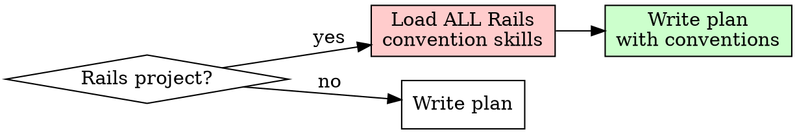

# Writing Plans

## Overview

Turn a spec into a short, ordered list of **vertical slices**. A slice is one user-facing capability cut through every layer it needs (migration + model + controller + view + test) — **shippable on its own** and **testable end-to-end on its own**.

The spec already says WHAT and WHY. The plan adds only three things: how the work is **sliced**, in what **order**, and the **end-to-end behavior** that proves each slice works. Assume a skilled executor with the codebase and the convention skills — they know HOW. Do not script it.

**Announce at start:** "I'm using the writing-plans skill to create the implementation plan."

## The one rule: slice vertically, never horizontally

Each task is a **vertical slice**, never a technical layer.

```
❌ HORIZONTAL — nothing works or ships until the last task
   Task 1: all migrations
   Task 2: all models
   Task 3: all controllers + policies
   Task 4: all views
   Task 5: write the tests
```
```
✅ VERTICAL — each task ships and is end-to-end tested on its own
   Slice 1: View the reading list    (migration + model + index action + view + system spec)
   Slice 2: Add a link               (create action + form + validation + Turbo Stream + system spec)
   Slice 3: Mark a link read/unread  (LinkRead record + toggle action + UI + system spec)
```

A slice is correct only when all three are YES:

- **Shippable on its own** — merge it and the app still works, with one more capability than before.
- **End-to-end testable on its own** — it carries a system/request spec that exercises the whole path, written and green *within the slice* — never deferred to a "write the tests" task at the end.
- **One capability** — something you'd describe to a user ("a member can now…"), not "the model layer".

If a task produces only a model, only policies, only a component, or only migrations, it is a layer — fold it into the first slice that uses it.

## Rails Projects - MANDATORY



**Before writing ANY task for a Rails project, you MUST load ALL convention skills:**

```
superpowers-rails:rails-controller-conventions
superpowers-rails:rails-model-conventions
superpowers-rails:rails-view-conventions
superpowers-rails:rails-policy-conventions
superpowers-rails:rails-job-conventions
superpowers-rails:rails-migration-conventions
superpowers-rails:rails-stimulus-conventions
superpowers-rails:rails-testing-conventions
```

The executor will load these skills and apply them. Plans reference conventions by name, not by duplicating their content.

| Rationalization | Reality |
|-----------------|---------|
| "I already know Rails conventions" | These are PROJECT conventions. Load them. |
| "I only need controller conventions" | A slice touches every layer. Load all. |
| "Too many skills" | ~2500 words total. 10 seconds to load. |

**Save plans to:** `docs/superpowers/plans/YYYY-MM-DD-<feature-name>.md`
- (User preferences for plan location override this default)

## Scope Check

If the spec covers multiple independent subsystems, it should have been broken into sub-project specs during brainstorming. If it wasn't, suggest separate plans — one per subsystem. Each plan must produce working, testable software on its own.

## Plan Document Header

**Every plan MUST start with this header:**

```markdown
# [Feature Name] Implementation Plan

> **For agentic workers:** REQUIRED SUB-SKILL: Use superpowers-rails:subagent-driven-development (recommended) or superpowers-rails:executing-plans. Each slice below is one unit of work — implement them in order, one subagent per slice. Slices use checkbox (`- [ ]`) syntax for tracking.

**Goal:** [One sentence describing what this builds]

**Architecture:** [2-3 sentences about approach]

**Spec:** [path to the spec this plan implements]

---
```

## Slice Structure

Each slice is the whole task. There is no per-step ceremony.

````markdown
### Slice N: [Capability — "A member can …"]

- [ ] **Delivers:** [the user-visible behavior this slice adds]
- [ ] **Touches:** `db/migrate/...`, `app/models/x.rb`, `app/controllers/y_controller.rb`, `app/views/...`, `spec/system/..._spec.rb`
- [ ] **End-to-end test (write first, watch it fail, then build the slice to green):**
  [The system/request scenario that proves the whole path: what the user does, what they should see. This is the slice's definition of done.]
- [ ] **Notes:** [Only what's non-obvious — intent level. Include EXACT code ONLY for: migrations & data migrations, destructive operations, or non-obvious config (cron syntax, middleware registration, API-specific handling).]
````

Do **not** expand a slice into "write failing test → run to confirm fail → implement → run to confirm pass → commit" steps. The executor runs TDD and commits per slice as a matter of course — the slice's end-to-end test IS the failing test they start from.

## No Placeholders

Every slice must carry real content. These are plan failures:
- "TBD", "TODO", "implement later", "handle edge cases" (without saying which)
- An end-to-end test described as "test that it works" (without the concrete scenario and what the user should see)
- "Similar to Slice N" (state it — slices may be read out of order)
- References to models/methods/routes not introduced by any slice

## When a slice won't slice (foundational work)

Some work is genuinely infrastructural — a refactor, or a shared abstraction nothing uses yet. Do not let it relapse into layer tasks. In order of preference:

1. **Fold it** into the first slice that consumes it. (Default.)
2. If too large to fold, make it the **thinnest increment that is still verifiable on its own** — it carries a test proving the new behavior, even if internal.
3. Only as a last resort, a standalone groundwork task — and state explicitly why it can't be folded or verified as a slice.

Never split foundational work back into model / controller / view layers.

## Red Flags — STOP, you're building horizontally

- A task titled by a layer: "models", "migrations", "controllers", "policies", "components", "routes"
- A task that produces only one layer and nothing a user can do
- A "write the tests" or "end-to-end system spec" task at the END of the plan
- A slice with no end-to-end test of its own
- Per-step write/run/implement/run/commit ceremony inside a task
- A slice's notes restate the spec, or script HOW line-by-line, instead of pointing at convention skills

| Rationalization | Reality |
|-----------------|---------|
| "The spec has a data-model section, so I'll make a model task" | The data model is split *across* the slices that use it. No model-only task. |
| "Build the foundation first, then features" | Foundation-first = nothing ships until the end. Fold foundations into Slice 1. |
| "Test everything at the end" | Each slice ships with its own e2e test, or it isn't a slice. |
| "Spelling out every step is safer" | It suppresses the executor's judgment and bloats the plan. State intent. |
| "This layer is shared, it deserves its own task" | Put it in the first slice that needs it; later slices extend it. |

## Self-Review

After writing the plan, check it against the spec with fresh eyes (a checklist you run yourself, not a subagent):

1. **Slice integrity:** Is every task a vertical slice — shippable on its own, carrying its own end-to-end test? Flag any task that's secretly a layer (model-only, "write tests" at the end) and re-slice it.
2. **Spec coverage:** Can you point to a slice for each spec requirement? Add a slice for any gap.
3. **Order:** Does each slice build only on earlier ones?
4. **Thinness:** Does every slice state intent and point at convention skills by name, rather than restating the spec or scripting HOW step-by-step? Exact code only for migrations, destructive ops, or non-obvious config? If you find spec re-statement or per-step ceremony, cut it. (Adding decomposition, file lists, and end-to-end scenarios is the plan's job — that is not bloat. Don't strip real intent to hit a size target.)

Fix issues inline.

## Execution Handoff

After saving the plan, offer execution choice:

**"Plan complete and saved to `docs/superpowers/plans/<filename>.md`. Two execution options:**

**1. Subagent-Driven (recommended)** - one fresh subagent per slice, review between slices, fast iteration

**2. Inline Execution** - execute slices in this session with checkpoints

**Which approach?"**

**If Subagent-Driven chosen:** **REQUIRED SUB-SKILL:** Use superpowers-rails:subagent-driven-development
**If Inline Execution chosen:** **REQUIRED SUB-SKILL:** Use superpowers-rails:executing-plans
